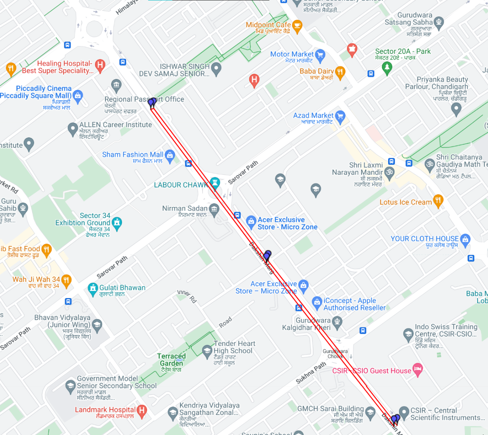
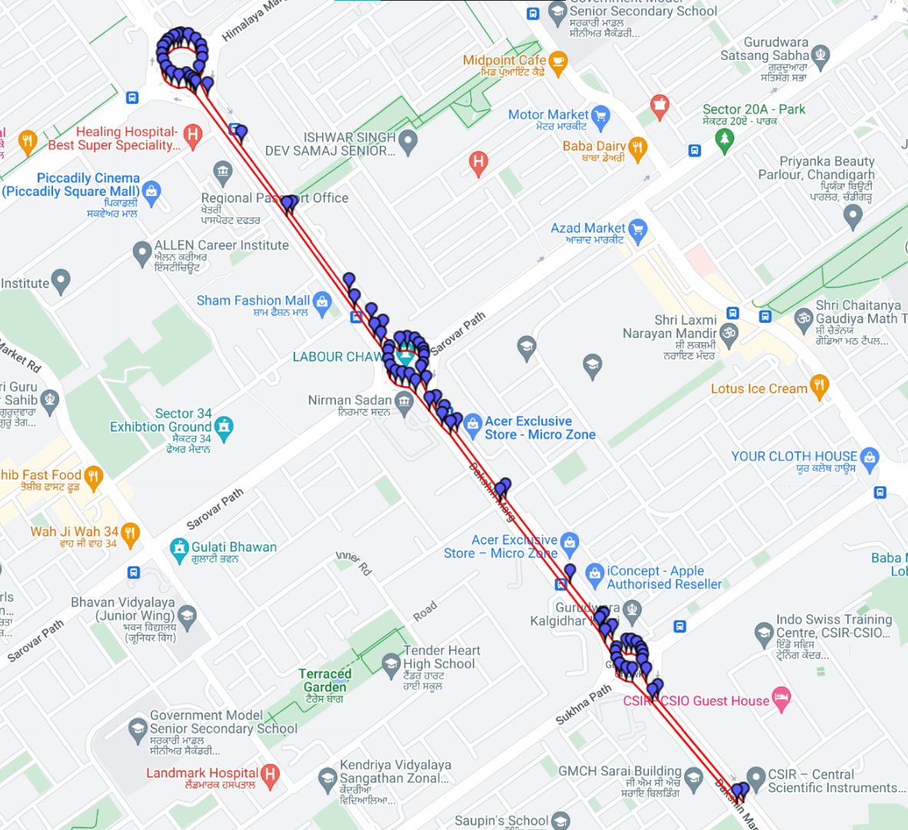
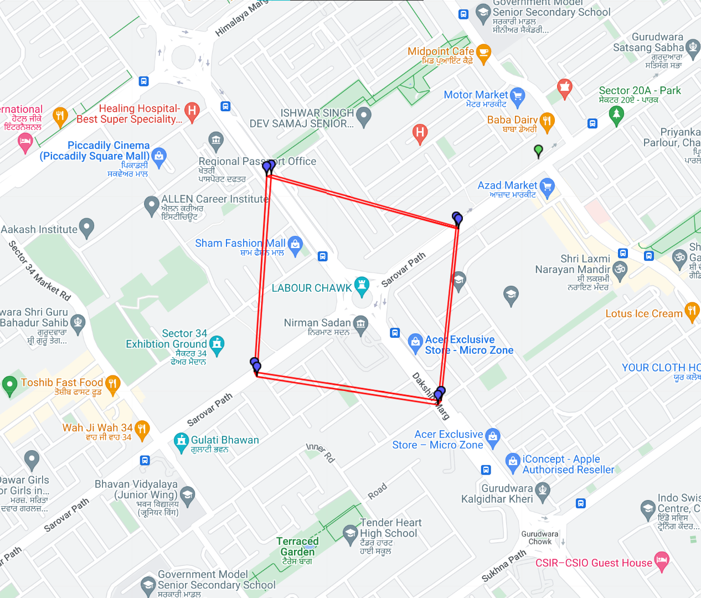
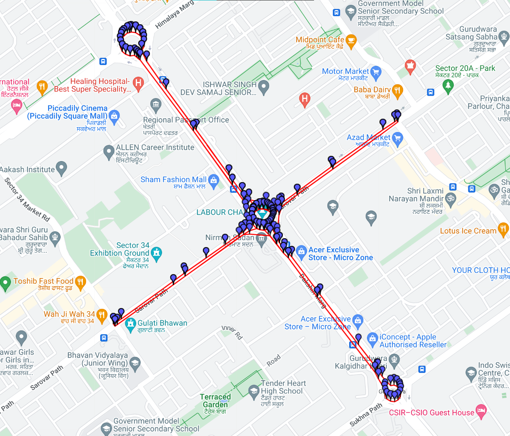

# Google-Maps-traffic-data-collector

This project serves to create a database of the traffic-flow conditions at the 129 main junctions in Chandigarh by sending automated requests to Google Maps using the Routes API. It can also be used as a template to perform a similar analysis across other cities.

## Motivation

To be filled 


## Methodology
In order to optimize data gathering, rather than sending a single request for each left, right and straight across a junction, I have opted to create larger requests which uses seperate waypoints as intermediates. 

<br>

For this, two types of requests are formed:
- **Roads:** To obtain the data for a straight across junctions, a request is created for a road that gets us data for straights across all the junctions present on the road in both directions.
- **Junctions:** To obtain data for right and left turns on junctions, a request is created which first travels along the four right turns that are possible at a junctions, and then the four left turns.

<br>

A file containing 364 waypoints across Chandgiarh's Roads is used to create the requests to be sent. These waypoints were manually identified and filled into a CSV. An extract of the CSV is given as a sample in the project which allows requests to be run for straights across three junctions lying on ***Dakshin Marg***, as well as right and left turns on ***Labour Chowk***. The format of the CSV is shown in the table below.

<br>
<br>

|    |   loc_latitude |   loc_longitude | loc_address                                                        | loc_road     | travel_direction   | loc_description                        |   intersection_next_latitude |   intersection_next_longitude | intersection_next_name                                       | intersection_next_localname   |   intersection_next_junction_no |   intersection_prev_latitude |   intersection_prev_longitude | intersection_prev_name                                       | intersection_prev_localname   |   intersection_prev_junction_no |   Bearing |
|---:|---------------:|----------------:|:-------------------------------------------------------------------|:-------------|:-------------------|:---------------------------------------|-----------------------------:|------------------------------:|:-------------------------------------------------------------|:------------------------------|--------------------------------:|-----------------------------:|------------------------------:|:-------------------------------------------------------------|:------------------------------|--------------------------------:|----------:|
|  0 |        30.7121 |         76.7809 | front of GMCH, 160047, Dakshin Marg, Sector 30, Chandigarh, 160030 | Dakshin Marg | NW                 | Between Iron Chowk and Gurudwara Chowk |                      30.7147 |                       76.7785 | Gurudwara Chowk, 32A, Sector 33, Chandigarh, 160047          | Gurudwara Chowk               |                              36 |                      30.7091 |                       76.7838 | 32 Medical Chowk, Sector 31 A, Sector 31, Chandigarh, 160030 | Iron Chowk                    |                              37 |       315 |
|  1 |        30.7121 |         76.781  | front of GMCH, 160047, Dakshin Marg, Sector 30, Chandigarh, 160030 | Dakshin Marg | SE                 | Between Gurudwara Chowk and Iron Chowk |                      30.7091 |                       76.7838 | 32 Medical Chowk, Sector 31 A, Sector 31, Chandigarh, 160030 | Iron Chowk                    |                              37 |                      30.7147 |                       76.7785 | Gurudwara Chowk, 32A, Sector 33, Chandigarh, 160047          | Gurudwara Chowk               |                              36 |       135 |
<br>

A CSV file containing the junctions for which we want data on left and right turns is also used. In the sample provided, only ***Tribune Chowk*** has been selected. The format is shown in the table below:

<br>

|    |   intersection_junction_no |   intersection_latitude |   intersection_longitude | intersection_name                                   | intersection_localname   | Road1        | Road2        | U-turn   |
|---:|---------------------------:|------------------------:|-------------------------:|:----------------------------------------------------|:-------------------------|:-------------|:-------------|:---------|
|  0 |                         35 |                 30.7205 |                  76.7734 | PQCF+59W, Sector 34B, Sector 34, Chandigarh, 160022 | Labour Chowk             | Dakshin Marg | Sarovar Path | True     |

<br>
<br>

### [Python File to send the Routes API requests](GoogleMapsRequests.py)

The GoogleMapsRequests.py program is used to send requests to the Routes API, and store the reponses as pickle files.
It makes use of the two CSV files to create the requests.
All main roads in Chandigarh form a grid, with all roads traversing either NW (SE in the opposite direciton) or NE (SW in the opposite direction). 

<br>

As the direction of all roads in Chandigarh is either NW (SE in the opposite direction) or NE (SW in the opposite direction), each road request is constructed as first travelling northwards and returning southwards.

<br>

For the road requests to be sent, the waypoints dataframe is first grouped on the basis of road that the waypoints lie on. 
```python
waypoints = pd.read_csv(f"{directory}{waypoint_filename}.csv")
waypoint_groups = waypoints.groupby("loc_road")
```

<br>

Each group is then iterated through, split into north and south, and then sorted accordingly before being joined together to get the waypoints in correct order for the request.
```python
# loop to send straights requests
    for road_name,roads_group_df in waypoint_groups:
        #skips if only one or two waypoints are given
        if(len(roads_group_df)<=2):
           continue
        print(road_name)
        
        # road heading north
        road_north = roads_group_df[(roads_group_df['travel_direction']=='NE') | (roads_group_df['travel_direction']=='NW')]
        # same road heading opposite direction (south)
        road_south = roads_group_df[(roads_group_df['travel_direction']=='SE') | (roads_group_df['travel_direction']=='SW')]

        # while going north, sort on latitude in ascending order, to have correct order of waypoints to form a straight
        road_north.sort_values('loc_latitude', ascending = True, inplace = True)
        if(road_name == "Madhya Marg"):
            road_north.sort_values('loc_longitude', ascending = False, inplace = True)
 
        # while going south, sort on latitude in descending order, to have correct order of waypoints to form a straight
        road_south.sort_values('loc_latitude', ascending = False, inplace = True)
        if(road_name == "Madhya Marg"):
            road_south.sort_values('loc_longitude', ascending = True, inplace = True)
            
       
        # stores sorted north south waypoints in group_df
        roads_group_df = pd.concat([road_north,road_south])
```

<br>


Polyline showing the waypoints used to send the request            |  Polyline obtained in response
:-------------------------:|:-------------------------:
  |  


The [Json response](SampleJsonResponse.txt) is stored along with other information in a pickled file, the format of which (for one row) is as follows:


| Columns                  | Row                                                                                                                                                                                                                                                                                                                                                                                                                                                                                                                            |
|:-----------------|:------------------------------------------------------------------------------------------------------------------------------------------------------------------------------------------------------------------------------------------------------------------------------------------------------------------------------------------------------------------------------------------------------------------------------------------------------------------------------------------------------------------------------|
| DateTime         | 07/10/2023 13:35:00                                                                                                                                                                                                                                                                                                                                                                                                                                                                                                           |
| User Time        | 13:35:00                                                                                                                                                                                                                                                                                                                                                                                                                                                                                                                      |
| Road             | Dakshin Marg                                                                                                                                                                                                                                                                                                                                                                                                                                                                                                                  |
| Travel Direction | SE                                                                                                                                                                                                                                                                                                                                                                                                                                                                                                                            |
| Polyline         | mmmzDugssMmc@f`@oa@b]IWfa@}\vc@q`@                                                                                                                                                                                                                                                                                                                                                                                                                                                                                            |
| start_lat        | 30.712066                                                                                                                                                                                                                                                                                                                                                                                                                                                                                                                     |
| start_lng        | 76.780914                                                                                                                                                                                                                                                                                                                                                                                                                                                                                                                     |
| end_lat          | 30.712106                                                                                                                                                                                                                                                                                                                                                                                                                                                                                                                     |
| end_lng          | 76.781047                                                                                                                                                                                                                                                                                                                                                                                                                                                                                                                     |
| Intermediates    | [{'lat': 30.712066, 'lng': 76.780914, 'junc name': 'Gurudwara Chowk', 'junc no': '36'}, {'lat': 30.717902, 'lng': 76.77559, 'junc name': 'Labour Chowk', 'junc no': '35'}, {'lat': 30.723424, 'lng': 76.77077, 'junc name': 'Piccadily Chowk', 'junc no': '34'}, {'lat': 30.723474, 'lng': 76.770885, 'junc name': 'Labour Chowk', 'junc no': '35'}, {'lat': 30.717986, 'lng': 76.775683, 'junc name': 'Gurudwara Chowk', 'junc no': '36'}, {'lat': 30.712106, 'lng': 76.781047, 'junc name': 'Iron Chowk', 'junc no': '37'}] |
| Distance         | 4207                                                                                                                                                                                                                                                                                                                                                                                                                                                                                                                          |
| Duration         | 729s                                                                                                                                                                                                                                                                                                                                                                                                                                                                                                                          |
| Response         | Json Response is stored in this column                                                                                                                                                                                                                                                                                                                                                                                                                                                                                        |                                                 


<br>
<br>

To create the junction requests, a dataframe is produced which contains all possible turns (including straights and U-turns) across each junction in the city, by merging waypoints on their next and previous junctions.
```python
# dataframe containing all start and end points of each turn at a junction
destinations = waypoints[['loc_latitude', 'loc_longitude', 'loc_address', 'loc_road',
       'travel_direction', 'loc_description', 'Bearing', 'intersection_next_latitude',
       'intersection_next_longitude','intersection_next_localname', 'intersection_next_junction_no']].merge(waypoints[['loc_latitude', 'loc_longitude', 'loc_address', 'loc_road',
       'travel_direction', 'loc_description', 'Bearing', 'intersection_prev_latitude',
       'intersection_prev_longitude', 'intersection_prev_localname',
       'intersection_prev_junction_no']], how = "inner",
                               left_on = 'intersection_next_junction_no',
                               right_on = 'intersection_prev_junction_no', 
                               suffixes =  ('_from',"_to"))
```

<br>

Out of this, the left and right turns are obtained and sorted such that all the reuqest first runs through all right turns and then through the left turns in a specific manner.
```python
# following code is to sort the rows in order of how the turn requests will be sent 
destinations_right = destinations[(destinations['Turn']=="Right")]
destinations_left = destinations[(destinations['Turn']=="Left")]

# for right turns in the request first right turn is NW to NE, second is SW to NW and so on
sorter_right = ['NW', 'SW', 'SE', 'NE']
# Similarly for left turns in the request first left turn is NW to SW, second is NE to NW and so on
sorter_left = ['NW', 'NE', 'SE', 'SW']

#travel direction from stores the direction of the road that the turn start from
destinations_right["travel_direction_from"] = destinations_right["travel_direction_from"].astype("category")
destinations_left["travel_direction_from"] = destinations_left["travel_direction_from"].astype("category")

# setting the category on the basis of which travel directions will be sorted
destinations_right["travel_direction_from"] =  destinations_right["travel_direction_from"].cat.set_categories(sorter_right)
destinations_left["travel_direction_from"] =  destinations_left["travel_direction_from"].cat.set_categories(sorter_left)

destinations_right.sort_values(["travel_direction_from"], inplace = True)  
destinations_left.sort_values(["travel_direction_from"], inplace = True)  

#joining left and rights df
destinations_right_left = pd.concat([destinations_right,destinations_left])
destination_groups = destinations_right_left.groupby('intersection_next_localname')
```
The groups are then iterated through, with each group containin the waypoints for a junction request. 

Polyline showing the waypoints used to send the request            |  Polyline obtained in response
:-------------------------:|:-------------------------:
  |  

<br>

The Responses are stored in a similar manner to the road requests.

<br>

## Author
**Sachit Sapra**


